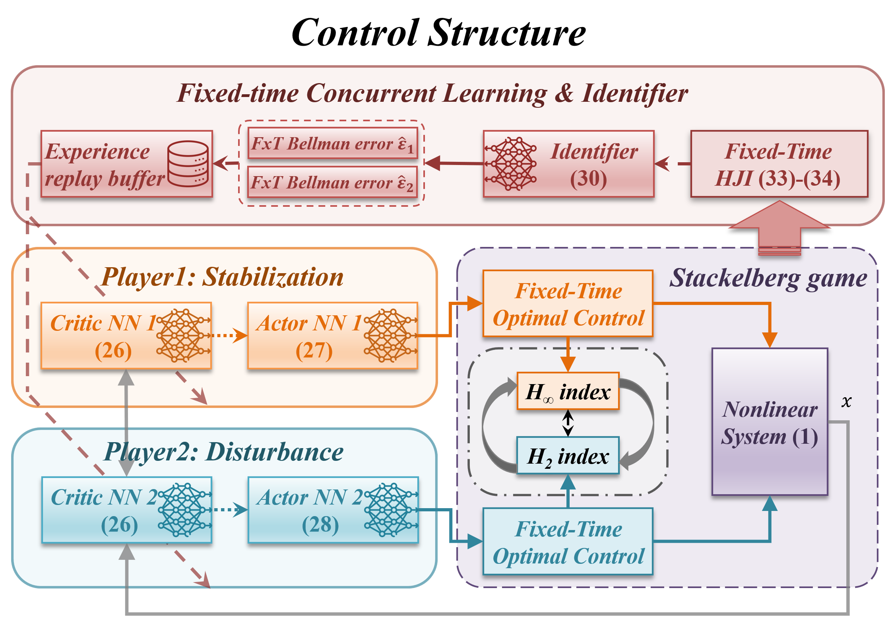
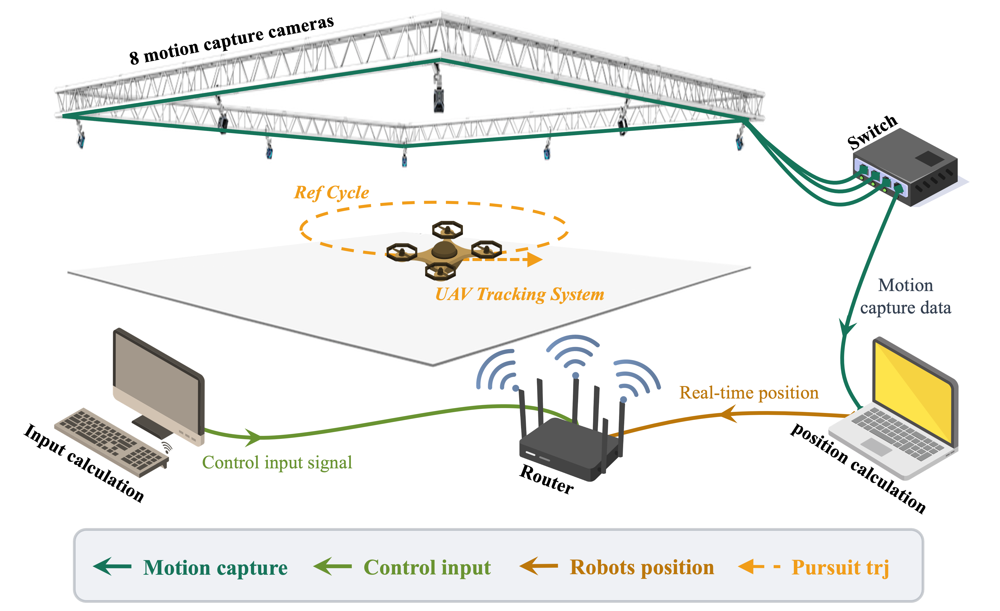

# Fixed-Time Concurrent Learning-based Robust Approximate Optimal Control

This repository contains the code for the paper "Fixed-Time Concurrent Learning-based Robust Approximate Optimal Control" submitted to the *Nonlinear Dynamics* Journal. The simulation demonstrates the effectiveness of the proposed method in controlling a nonlinear system with uncertainties.

+ Details of the paper can be found at: [Junkai Tan's Publications](https://tanjunkai2001.github.io/publications/)
+ Download the paper at: [Download pdf](https://tanjunkai2001.github.io/assets/Unmanned%20aerial-ground%20vehicle%20finite-time%20docking%20control%20via%20pursuit-evasion%20games.pdf)

## Citation

If you use this code or find our research helpful, please cite our paper:

```bibtex
@article{Tan2025,
    author = {Tan, Junkai and Xue, Shuangsi and Niu, Tiansen and Qu, Kai and Cao, Hui and Chen, Badong},
    title = {Fixed-Time Concurrent Learning-based Robust Approximate Optimal Control},
    journal = {Submitted to Nonlinear Dynamics},
    year = {2025},
    month = {March}
}
```
<!-- ,
    doi = {10.1007/s11071-025-11021-6},
    url = {https://doi.org/10.1007/s11071-025-11021-6} -->
## Overview

Simulation: Fixed-Time Concurrent Learning-based Robust Approximate Optimal Control for a nonlinear system with uncertainties.
<div style="display: flex; justify-content: space-between;">
    
    
</div>

The code is implemented in MATLAB and includes the following files:
- `Simulation/main_FxT_CL_ADP.m`: Main file to run the simulation
- `Simulation/plot_fig_FxT_CL_ADP.m`: Main file to plot the results
- `Data/data_case1.mat`: Data file containing the results of the simulation
